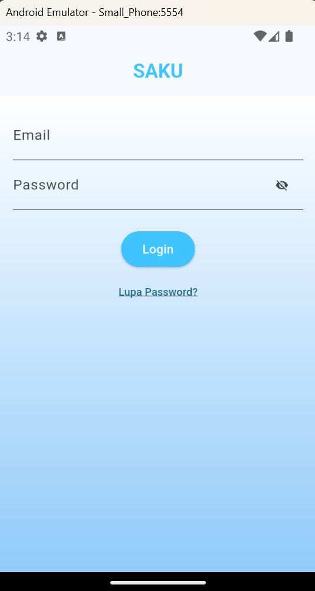
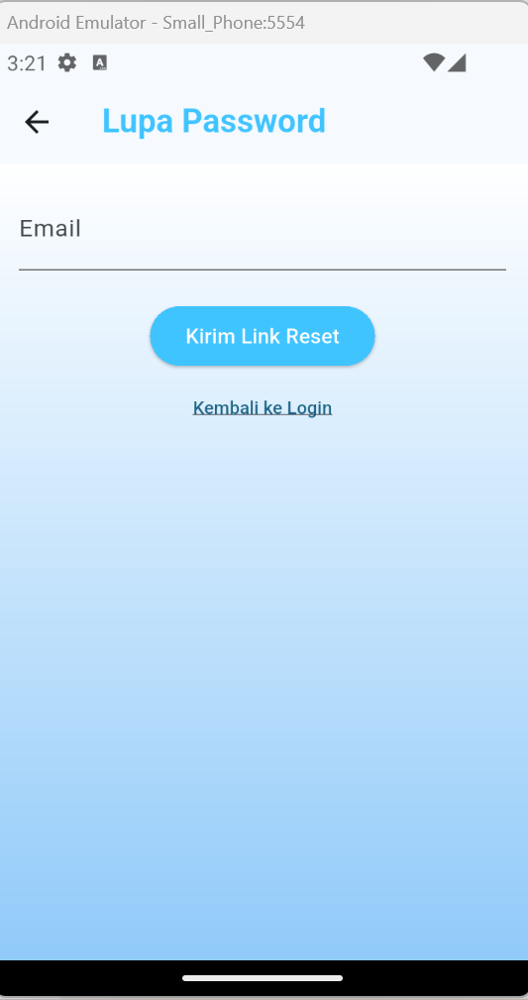
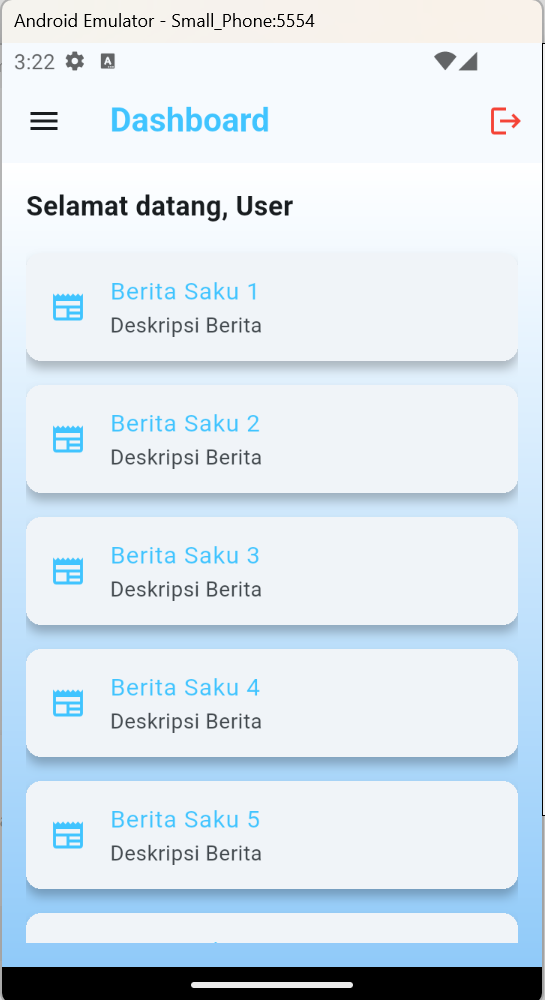

# saku

# UTS Flutter App

## Deskripsi Aplikasi
Aplikasi ini merupakan project Ujian Tengah Semester (UTS) mata kuliah Mobile Programming menggunakan Flutter.  
Aplikasi terdiri dari 3 halaman utama yaitu Login, Lupa Password, dan Dashboard.

Aplikasi ini dibuat untuk mengimplementasikan konsep dasar Flutter seperti:
- Widget
- Navigation
- State Management
- Form & Validasi

---

## Fitur Aplikasi

### 1. Login Screen
- Input Email dan Password
- Validasi:
  - Email tidak boleh kosong & harus mengandung '@'
  - Password minimal 8 karakter dan mengandung huruf & angka
- Toggle show/hide password
- Loading indicator saat login
- Error message jika login gagal
- Navigasi ke Dashboard jika login berhasil
- Navigasi ke halaman Lupa Password

---

### 2. Lupa Password Screen
- Input email
- Validasi email
- Tombol kirim link reset
- Loading indicator
- Snackbar sebagai feedback
- Tombol kembali ke login

---

### 3. Dashboard Screen
- Menampilkan user yang login
- AppBar dengan tombol logout
- ListView (10 item dummy)
- Card UI dengan styling
- Logout menggunakan `pushAndRemoveUntil`

---

## Akun Login (Testing)
Email: admin@test.com
Password: Admin123

---

## Teknologi yang Digunakan
- Flutter
- Dart

---

## Struktur Folder
lib/
├── models/
│ └── user_model.dart
│
├── screens/
│ ├── login_screen.dart
│ ├── forgot_password_screen.dart
│ ├── dashboard_screen.dart
│
├── utils/
│ └── validators.dart
│
└── main.dart

---

## Cara Menjalankan Aplikasi

1. Clone repository:
git clone <https://github.com/antasueta/saku>

2. Masuk ke folder project:
cd saku

3. Install dependency:
flutter pub get

4. Jalankan aplikasi:
flutter run

---

## Screenshot
1. Login Screen

2. Lupa Password

3. Dashboard Screen

---

## Catatan
- Aplikasi menggunakan state management sederhana (`setState`)
- Validasi dilakukan di sisi client menggunakan `Form` dan `TextFormField`

---

## Author
Nama: I Kadek Dwi Ananta Sueta 
NIM: 21104136